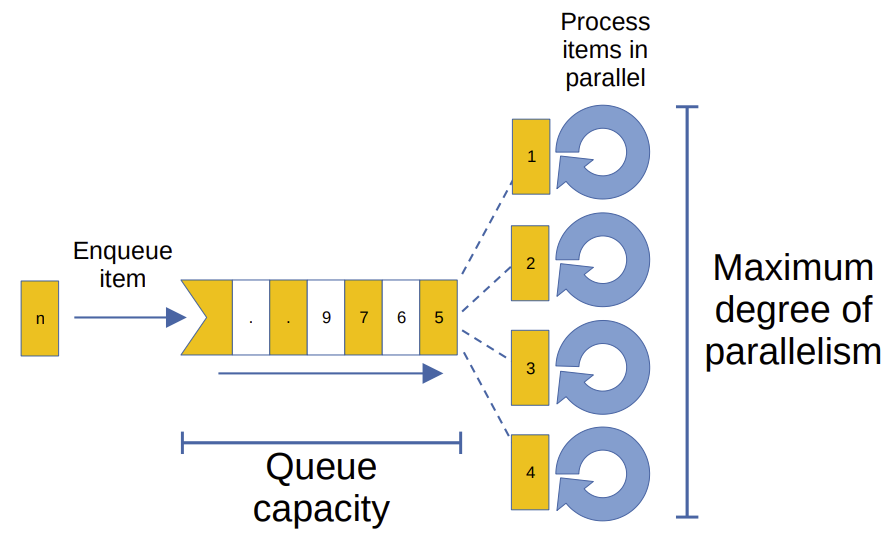

# Baksteen.Async.ConcurrentProcessingQueue
Async queue that automatically processes items concurrently with a specified parallelism limit.

## Diagram


## Usage

```csharp
using System;
using System.Threading;
using System.Threading.Tasks;
using Baksteen.Async;

// create queue with a capacity of 5 items and a maximum of 8 concurrent process threads
// please note the 'await using' as this class is IAsyncDisposable
await using(var queue = new ConcurrentProcessingQueue<int>(5, 8, processItem))
{
    for(int t = 0; t < 100; t++)
    {
        Console.WriteLine($"enqueueing {t}");
        await queue.Enqueue(t);
    }
    await queue.WaitForCompletion();  // this will wait until all items have been processed
}

static async ValueTask processItem(int x, CancellationToken ct)
{
    Console.WriteLine($"processing item {x}");
    // simulate some processing work:
    await Task.Delay(Random.Shared.Next(500, 2000), ct);
}
```
